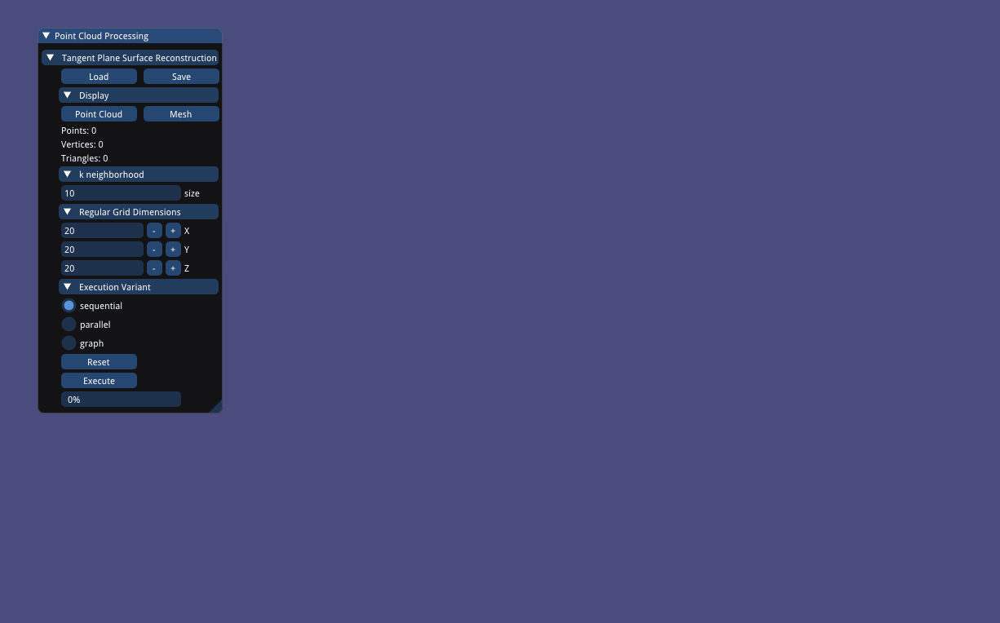

# Point Cloud Processing Toolkit

| Windows | Ubuntu | MacOS |
| --- | --- | --- |
| [](https://ci.appveyor.com/project/Q-Minh/point-cloud-processing/branch/master) | [](https://ci.appveyor.com/project/Q-Minh/point-cloud-processing-05x2j/branch/master) | [](https://ci.appveyor.com/project/Q-Minh/point-cloud-processing-m4p2m/branch/master) |
   
[](https://codecov.io/gh/Q-Minh/point-cloud-processing) 
[](https://www.boost.org/LICENSE_1_0.txt)

## Overview

`pcp` is a toolkit of common point cloud processing algorithms using C++17.



## Prerequisites

- [CMake](https://cmake.org/)
- [C++17](https://en.cppreference.com/w/cpp/17)

## Usage

```
#include <execution>
#include <filesystem>
#include <pcp/pcp.hpp>
#include <range/v3/view.hpp>

int main(int argc, char** argv)
{
    using point_type      = pcp::point_t;
    using point_view_type = pcp::point_view_t;
    using normal_type     = pcp::normal_t;

    std::filesystem::path input_ply{argv[1]};
    auto [points, normals] = pcp::io::read_ply<point_type, normal_type>(input_ply);

    auto point_views =
        points | ranges::views::transform([](auto& point) { return point_view_type{&point}; });

    using octree_type = pcp::basic_linked_octree_t<point_view_type>;
    octree_type octree{point_views.begin(), point_views.end()};

    std::vector<float> density(points.size(), 0.f);
    std::transform(
        std::execution::par,
        point_views.begin(),
        point_views.end(),
        density.begin(),
        [&](auto const& p) {
            pcp::sphere_t<pcp::point_t> sphere{};
            sphere.radius              = 0.01f;
            sphere.position            = point_type{p};
            auto const points_in_range = octree.range_search(sphere);
            auto const pi              = 3.14159f;
            auto const r3              = sphere.radius * sphere.radius * sphere.radius;
            auto const volume          = 4.f / 3.f * pi * r3;
            return static_cast<float>(points_in_range.size()) / volume;
        });

    normals.resize(points.size());

    auto const knn = [&octree](auto const& p) {
        return octree.nearest_neighbours(p, 15u);
    };

    pcp::algorithm::estimate_normals(
        std::execution::par,
        point_views.begin(),
        point_views.end(),
        normals.begin(),
        knn,
        pcp::algorithm::default_normal_transform<point_view_type, normal_type>);

    pcp::io::write_ply(
        std::filesystem::path{argv[2]},
        points,
        normals,
        pcp::io::ply_format_t::binary_little_endian);

    return 0;
}
```

## Documentation
Documentation is generated using Doxygen, Sphinx and Breathe. 
To generate documentation, you will need to install them. 

1. - For Doxygen, refer to [the official download page](https://www.doxygen.nl/download.html). Make sure that you add the doxygen executable to your path. 
   - For Sphinx, refer to [the official installation page](https://www.sphinx-doc.org/en/master/usage/installation.html). Then, using [pip](https://pypi.org/project/pip/), run:

     ```$ pip install sphinx_rtd_theme```
   - For Breathe, using [pip](https://pypi.org/project/pip/), run:

     ```$ pip install breathe```

2. Then, using CMake, to generate the documentation only, run:
   ```
   $ cmake -S . -B build -DPCP_BUILD_DOC=ON -DPCP_BUILD_TESTS=OFF -DPCP_BUILD_BENCHMARKS=OFF    -DPCP_BUILD_EXAMPLES=OFF
   
   $ cmake --build build --target pcp-sphinx
   ```

3. Browse our readthedocs style documentation by opening `./build/doc/sphinx/index.html` in your 
   browser of choice.

Credits go to [https://devblogs.microsoft.com/cppblog/clear-functional-c-documentation-with-sphinx-breathe-doxygen-cmake/](https://devblogs.microsoft.com/cppblog/clear-functional-c-documentation-with-sphinx-breathe-doxygen-cmake/). If you encounter any problems, try reading this long form blog.

## Examples
You can find detailed usage examples of `pcp` [here](./examples/).

## Tests
Explore `pcp`'s tests [here](./test/) for even more usage examples. The tests use [Catch2](https://github.com/catchorg/Catch2).
