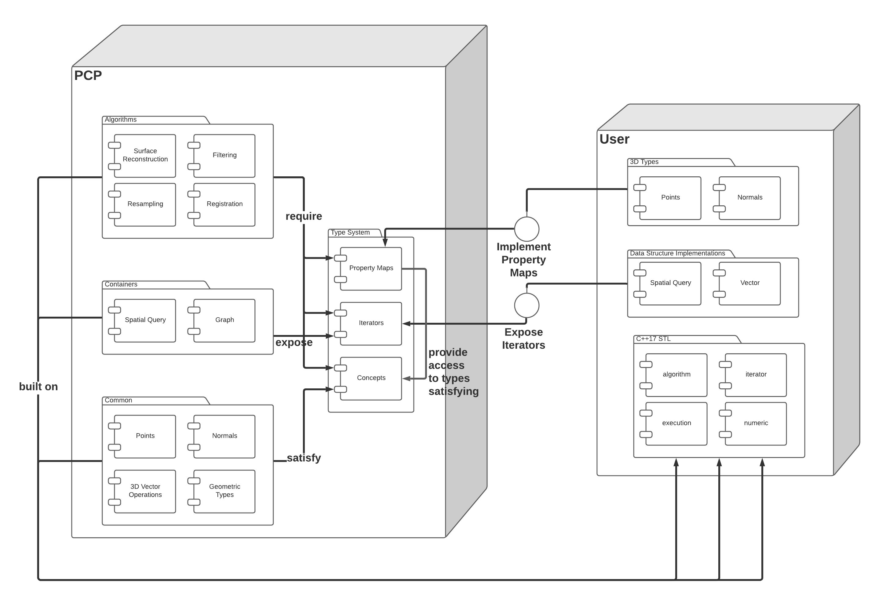

.. toctree::
   :maxdepth: 2
   
API
===

Goals
-----

**pcp**'s main goals are:

- **memory efficiency**
- **STL integration**
- **flexibility/customizability**
- **transparency**

Design
---------

**pcp** enables users to hook into its features at all 
levels of the stack by using relaxed type requirements 
through *property maps*, *concepts* and *iterators* that 
mediate between **pcp** and its **user**. **Users** can benefit 
from **pcp**'s containers and algorithms even if they 
already have specific existing types that they must honor. 

By using property maps, **users** need only provide callable 
types which take the **user**'s types as input, and return, or *map* to,
a corresponding *property* that **pcp** needs in order to 
execute. For example, if a **pcp** algorithm requires points 
and densities, it will only ask the **user** to provide a 
*PointMap* and a *DensityMap* which map the **user**'s data 
to points and densities. In doing so, we greatly minimize 
type restrictions potentially placed on the **user**'s code.

**pcp** containers also depend only on **pcp**'s type system, 
which once again decouples **user** and **pcp**. 
Additionally, **pcp** containers expose STL-compatible *iterators* which enables 
the **user** to use modern C++ features on **pcp** containers. 
**pcp** containers can contain any type, once again, provided the **user** 
kindly gives **pcp** the required *property maps*. For example, 
you could theoretically use a **pcp** octree of strings, if you would 
like, as long as you provide the **pcp** octree with a *property map* 
that associates each string with a point.

Though we try to minimize type restrictions as much as possible, 
we do impose some type restrictions in the form of *concepts/type requirements* 
such as the *Point* concept and the *Normal* concept. However, you will find that 
these *concepts* are fairly non-restrictive and **pcp** provides sensible default 
implementations of those *concepts*. **pcp** will output user-friendly error 
messages at compile-time whenever possible to ensure that *concepts* are 
satisfied. Concept checking is implemented in the **traits** module of **pcp**.

For users having the luxury of starting a project from scratch using **pcp**, 
the flexibility and customization points offered by **pcp** can still be a 
nice asset, enabling them to use their own implementations that may surpass **pcp** 
implementations for their use cases.

Lastly, **pcp**'s iterator interface and non-restrictive type requirements on 
points enable memory efficiency by way of *point views* and lazy evaluation. 
Application code may only need to load one instance of a point cloud in memory, 
while still using spatial acceleration structures and filtering, for example, 
without any copies except pointer copies across the whole processing pipeline 
from disk input to disk output.

Reference
---------

The API is divided into the following modules:

.. toctree::

   algorithm
   common
   graph
   io
   octree
   traits